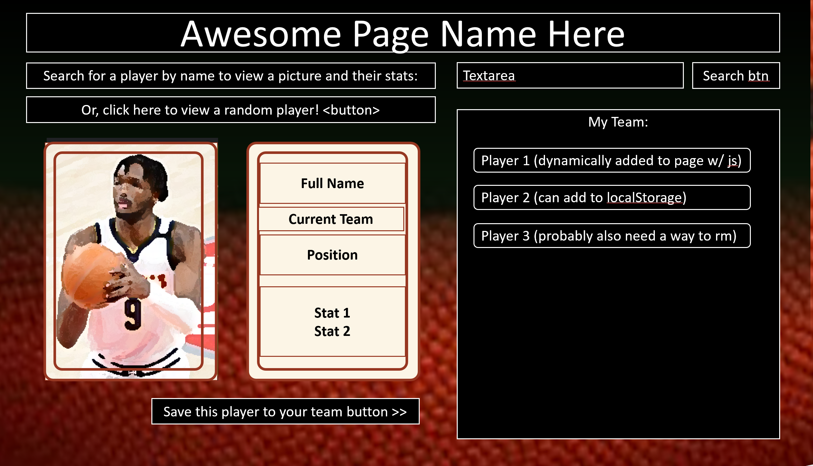
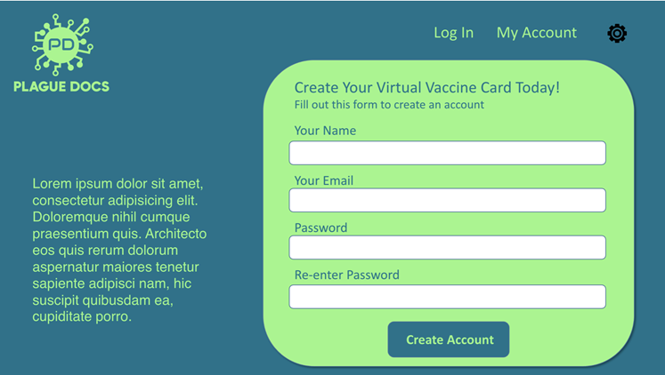

# Christi's Portfolio

## Description

A React website featuring six of my projects, an about me section resume and a contact page.

## Table of Contents

- [Installation](#installation)
- [Usage](#usage)
- [License](#license)
- [Contributing](#contributing)
- [Tests](#tests)
- [Questions](#questions)

## Installation
Git clone then in the project directory, you can run `npm start`,`npm test`,`npm run build`
Runs the app in the development mode.\
Open [http://localhost:3000](http://localhost:3000) to view it in your browser.

## Usage
My Portfolio 

Github URL 
https://github.com/chl850405/christi-portfolio.git 

The back end created for the E-Commerce site.

https://github.com/chl850405/e-commerce.git

View video to see MySQL walk through via [Screencastify](https://drive.google.com/file/d/1Em_LQH1I-NgwqmKpxgeBkXy71hx4clSp/view) 
View video to walk through of the API routes. [Screencastify](https://drive.google.com/file/d/19HxHUsCz4v2iva7JGcpbhywtCO3b4wU0/view) 
View video to see Insomnia walk through via [Screencastify](https://drive.google.com/file/d/1X3CGbwAnfSOz93SGSwwQJkQPpCrbXOEH/view)

Keep track of your budget online or offline.

Deployed: https://budgettr4k3r.herokuapp.com/

Github: https://github.com/chl850405/budget-tracker.git

Write and save notes.

Deployed: https://n0t3-t4k3r.herokuapp.com/notes

Github: https://github.com/chl850405/note-taker.git

Deployed: https://github.com/chl850405/Password-Generator.git

Github: https://chl850405.github.io/Password-Generator/

Build a NBA fantasy team.

Deployed: https://chl850405.github.io/top-score

Github: https://github.com/chl850405/top-score.git

Search a city's current weather and five day forecast.

Deployed: https://chl850405.github.io/real-time-weather/

Github: https://github.com/chl850405/real-time-weather.git

Plague Docs allows you to keep your COVID vaccine card conveniently store in your virtual wallet.

Live URL: https://plague-docs.herokuapp.com/

GitHub Repository: https://github.com/chl850405/plague-docs-copy

## License

This project does not have a license.

## Contributing

Contributors should read the installation section.

## Tests

There are no tests for this project.

## Questions

If you have any questions about this projects, please contact me directly at christimarchetti@gmail.com. You can view more of my projects at https://github.com/chl850405.
